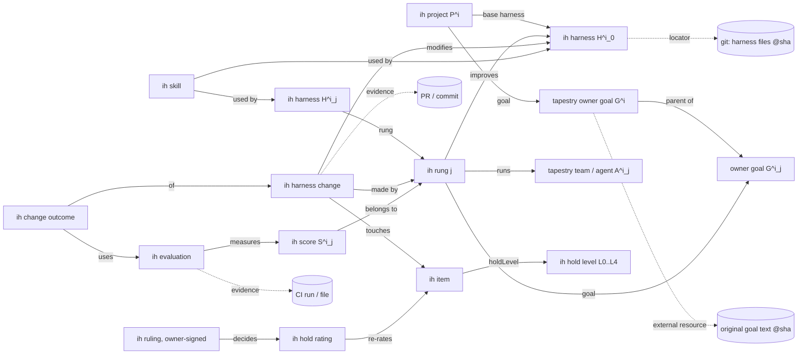

# Proposal: an IH concept model for a Tapestry instance

**Status: L3 (disclosed); the whole note is a proposal.** The CoS maintains this note under the scale in [`hold-axis.md`](hold-axis.md) and records each change and its reason in the changelog at the bottom. Nothing in it has been written to any Tapestry instance. Adopting any part of it, and any write to David's instance, needs David's sign-off.

**What David asked for.** A way to represent IH data in his locally running Tapestry instance, using a feature he stressed: the concept graph's Neo4j often holds only *pointers* to data that lives elsewhere (a repo file, a local DB, a URL, a nostr event), in any format. The harness files stay in git, where diffs are auditable, and the graph holds structure plus pointers.

**Sources and honesty.** §1 comes from the Tapestry repo (`nous-clawds4/tapestry`, `main` at `1e518034`, read 2026-09-27). File citations give `path:line` against that commit. §2 comes from two read-only commands run on David's Mac at about 6:15 PM ET on 2026-09-27: GET requests only, no writes, no signing. Everything from §3 on is design, marked **proposal**. Inferences are marked **(inference)**.

## 1. How Tapestry's concept graph works

**A concept is a list header plus a fixed skeleton.** On the wire, a concept is a DList header: kind **39998** (replaceable ListHeader; kinds 9998/9999 are the legacy non-replaceable forms). Its elements are kind **39999** events whose `z` tag holds the header's address (`protocols/drafts/tapestry-concepts.md` § "Event kinds", § "Addressing"). Every node is addressed as `<kind>:<pubkey>:<d-tag>`, and that string is stored as the Neo4j `uuid` (`BIBLE.md` §5). "What makes something a concept is **not its event kind** — it's its **position in the graph**" (kind unification, same draft).

When `create-concept` runs, it mints the header plus the core nodes: a Superset, a JSON Schema, a Primary Property, a Properties set, and the property-tree, core-nodes and concept graphs (`BIBLE.md` §9, §11). It wires them with `IS_THE_CONCEPT_FOR`, `IS_THE_JSON_SCHEMA_FOR` and similar edges (§6). The **class thread** `ConceptHeader → IS_THE_CONCEPT_FOR → Superset → IS_A_SUPERSET_OF* → HAS_ELEMENT → element` is how elements are found (§6).

**Instances and properties.**

- **Each instance is a kind-39999 event.** Its data sits in a `json` tag in "word-wrapper" format (`BIBLE.md` §8). The second-brain concepts use one top-level section per concept, for example `{"externalResource": {...}}` (`src/api/normalize/index.js:2613`).
- **Properties come from the concept's JSON Schema.** `POST /api/normalize/save-schema` takes `{concept, schema}` (`src/api/normalize/index.js:1907`), and the property tree (Property nodes, `IS_A_PROPERTY_OF`) is generated from the schema (`BIBLE.md` §6).
- **Uniqueness is not enforced by the server.** "`x-tapestry.unique` is advisory only — no server code enforces it"; each write endpoint that cares must refuse duplicates itself (second-brain ADR 0004, Context).

**Relationships.**

- **Most relationships are derived** from event structure: the `z` parent pointer, and the `n`/`s` class-thread tags. "Only editorial/provenance relationships (IMPORT, SUPERCEDES, PROVIDED_THE_TEMPLATE_FOR, ENUMERATES) are explicit nostr events" (`tapestry-concepts.md`).
- **Hand-made edges are narrow.** `POST /api/normalize/add-relationship` adds a single Neo4j-only edge, but its whitelist is just `HAS_ELEMENT` and `IS_A_SUPERSET_OF` (`BIBLE.md` §11).
- **The `b` tag carries pointers between nodes.** On a 39998 or 39999 event, `["b", <address>, "pointer"]` derives `REFERENCES {source:'b-tag'}`, which is "a bookmark, not agreement". `"inherit"` derives `INHERITS_FROM` (`BIBLE.md` §22, §25).
  - On current `main` no general endpoint authors a `b` tag. `POST /api/normalize/set-b-tag` exists only in the open **PR #759** (vcavallo), which targets `main` from a feature branch and fails the repo's `main-source-guard`.
- **The second brain links by record field, never by edge.** A pointer is a field in the element's JSON (a goal slug, say) that is dereferenced at read time "by grouping — never an edge". The `HAS_RESOURCE`-edge option was rejected because it needs the whitelist extended and "would not survive export/restore" (ADR `second-brain/0004`, Decision 2 and Option B).

**How concepts are created.** There are five routes.

| Route | Mechanism | Citation |
|---|---|---|
| UI | Concepts → New Concept calls `createConcept({name, plural, description})` → `POST /api/normalize/create-concept` | `ui/src/pages/concepts/NewConcept.jsx:5,32`; `ui/src/api/normalize.js:17` |
| HTTP API | `POST /api/normalize/create-concept` with body `{name, plural?, description?, dTag? \| random? \| nonce?, conceptHeaderOverrides?}`, then `save-schema {concept, schema}`, then `create-element {concept, name, json}`. Plus `save-element-json {uuid, json}` and `set-json-tag`. | routes `src/api/normalize/index.js:5472-5474`; handlers `:1183`, `:1907`, `:1760` |
| Purpose-built brain writes | `create-child-goal`, `update-goal-intent`, `create-resource`, `verify-resource`, `create-work-record`, `note-goal-idea`, `make-proposal`, `approve-proposal`, `skip-proposal`, `record-priority-signal`. Each validates its input and refuses by name (e.g. `goal-not-found`, `resource-exists`). | `src/api/normalize/index.js:5476-5485`; handlers `:2190`, `:2523`, `:2831`, `:3158`, `:3266` |
| CLI | `tapestry concept add <name> [items...]`, `tapestry concept element <concept> <name>`, `tapestry concept schema <concept>` (tapestry-cli, a separate public repo) | `BIBLE.md` §12. The tapestry-cli repo was last pushed 2026-03-27, so it may lag the API **(inference)** |
| Nostr | Any key may publish kind 39998/39999 events. A client-signed event reaches the local relay through `POST /api/strfry/publish`, which verifies the signature and is otherwise permissionless. Firmware concepts come from `firmware/active/` via `POST /api/firmware/install`, which itself calls `create-concept`/`create-element`. | `src/api/strfry/commands/publishEvent.js:74-92`; `src/firmware/install.js:171,245`; `BIBLE.md` §7 |

**Who may write.**

- **The middleware gate.** `/api/normalize` is on the owner-only POST list (`src/middleware/auth.js:423`). A request passes if it comes from an owner session (a NIP-07 sign-in) **or** from a "genuinely-direct-local" caller: loopback peer and no proxy header (`req.localTrusted`, `auth.js:343-363`).
- **The handler gate.** The brain write handlers re-assert `isOwner(req) || req.localTrusted` (for example `:2192-2195`).
- **What this means for agents.** A local agent that reaches the app over loopback (brainstorm-harness does it with `docker exec … curl`) passes the same gate as the owner. From the Mac host, `localhost:7778` is not loopback inside the container: the brain read `GET /api/brain/goals` answered 403 (§2).

**Signing.**

- **Every normalize write is TA-signed.** It is signed with the instance's Tapestry Assistant (TA) key, loaded from secure storage at startup (`loadTAKey`, `src/api/normalize/index.js:90`; `signAndFinalize`, `:105`). It is then written to local strfry by `strfry import` (`publishToStrfry`, `:115`) and imported into Neo4j (`importEventDirect`).
- **These writes stay local.** The second-brain writes are "local-only, never publishEverywhere" (`:2129`).
- **What the keys mean.** `BIBLE.md` §31: the TA is "the instance's 'me'" and a hot server key. The owner's key is "cold — interactive signing (NIP-07 / external signer); never held server-side". Owner-authored letters enter the brain "only by an explicit, auditable act".
- **Unsigned state exists too.** Event-less nodes (`add-subset`) and the relationship primitives are Neo4j-only and unsigned. Under §30 such state is precious, and "only a Neo4j backup preserves" it.

**How external pointers are expressed today.**

1. **The `tapestry external resource` concept** (second-brain ADR 0004, 2026-07-23): `locatorKind` is one of `file`, `vault-note`, `nostr-event`, `repository` or `web-address` (`src/api/normalize/index.js:2409`), and `locator` is a free string. Each resource also carries a title (stored as `name`), `whyKept`, `keywords`, `notedOn`, `lastVerified` and `lastVerifyStatus`. Freshness (`current`/`stale`/`unreachable`) is derived at read time. Its identity is (goal, locator), and it must attach to exactly one existing goal (`createResource`, `:2554`). The concept's own description reads: "The brain organizes knowledge; it never contains it."
2. **Record fields** naming another element's slug (the `parent` and `goal` idiom above).
3. **Pointer-typed `b` tags** to any nostr address (§22).
4. **`lmdb:<tapestryKey>`**, which offloads a large `json` value to the local LMDB store. It is a storage detail, not a semantic pointer (§8, §29).

## 2. What the local instance showed

Two read-only commands against `http://localhost:7778` on David's Mac (`/api/status`, `/api/firmware/versions`, `/api/audit/firmware`, the two primitive probes, `/api/brain/goals`, `/api/concept-graph/summaries`, and `/neighbors` for six concepts):

- **Running and current enough.** strfry up 30 days; firmware **v1.0.0** active; the `relationship-primitives` and `node-primitives` probes present. I found no endpoint that reports the running commit, so the code version is unknown.
- **TA pubkey `11f23fe4…`.** This is the same prefix second-brain ADR 0004 cites from its "live instance" recon, so that design was probably reconnoitred on this instance **(inference)**.
- **63 concept headers**, including: `tapestry owner goal` (35 elements), `tapestry proposal` (10), `tapestry work record` (8), `tapestry external resource` (**0**), `tapestry restore drill` (1), `goal set` (2), `word` (584), `trusted dictionary snapshot` (117), `adoption disposition` (294).
- **Four concepts that appear in no repo code, docs or ADRs I searched** (my `git grep`), so David presumably created them by hand **(inference)**:
  - `tapestry team` (2 elements): "Something that can be handed a goal and carry it out: a team of roles, a script, or a single session given a prompt. Each entry POINTS at where it is really defined; its internals never live here."
  - `tapestry executive action` (4): "A standing instruction the Executor runs again and again — the top-level loop that tends the goal concept and mediates attention…"
  - `tapestry privacy level` (3): "levels of privacy for data stored in the second brain…"
  - `maturational state of a concept` (7).
- **`project for the engineering team`** (5 elements) is named in a second-brain story but is a different idea: "outlines of new features or bug fixes for tapestry…".
- **Owner-only reads are closed from the host.** `GET /api/brain/goals` → HTTP 403 "Owner access required", as expected from outside the container.

**The lesson from §2:** David's instance already has most of the parts IH needs. `tapestry owner goal` is a goal with a statement, a "done means" and a "stays inside". `tapestry external resource` is the pointer. `tapestry team` is a pointer-only home for whatever carries out a goal. `tapestry proposal` is an append-only sign-off loop. `tapestry work record` is an append-only log. The proposal below reuses them where they fit.

## 3. Design principles (proposal)

1. **Git holds the text; the graph holds structure and pointers.** Every harness file, goal text and review stays in git. A graph element names it by a locator pinned to a commit. The proposed convention is `locatorKind: "repository"` and `locator: "github.com/<owner>/<repo>@<sha>:<path>[#anchor]"`. Pinning the SHA keeps the audit trail. Tracking a moving branch would not.
2. **Append-only facts for anything that changes.** Changes, predictions, outcomes, re-ratings, rulings and evaluations are new elements, never edits. This follows `tapestry proposal` and `tapestry work record` ("Never edited; corrections are new records").
3. **Link by record field in v1.** Relationships are fields holding slugs, dereferenced at read time, as in second-brain ADR 0004. Graph edges wait for `set-b-tag` (pointer-typed `b` → `REFERENCES`) or a whitelist extension.
4. **Reuse before inventing.** The IH-specific concepts get an `ih ` name prefix so they cannot collide with personal second-brain data.
5. **The graph records the hold axis; the owner's key enforces it** (§6).

## 4. Proposed concepts

Here "fields" means the concept's JSON section. `→` marks a record-field link to another element (by slug).

| Concept | Reuse or new | Fields | Links | External pointers |
|---|---|---|---|---|
| **Project** $P^i$ | new `ih project` | `index` (0, 1, 2 …), `name`, `status`, `openedOn` | → Goal ($G^i$), → Harness ($H^i_0$), → Agent ($A^i$) | `repository` (the project repo) |
| **Goal** $G^i_j$ | **reuse `tapestry owner goal`** | `statement`, `deliverable` (done means), `boundary` (stays inside), `origin`, `capturedOn` | → `parent`. A rung goal $G^i_j$ ("improve $H^i_{j-1}$") is a child of $G^i$ | a `tapestry external resource` on the goal, pointing at the **original** goal text at a pinned SHA, for the drift check (d) |
| **Harness** $H^i_j$ | new `ih harness`, also registered as a `tapestry team` entry | `project`, `rung` ($j$), `version` (commit SHA), `status` | → Project, → Rung, → `supersedes` (previous version) | `repository` locators for each harness-definition path |
| **Rung** $j$ | new `ih rung` | `project`, `j`, `scoreDefinitions`, `minHistory` (the §1 measurement gate), `mode` (`separate` or `merged-into-lower`) | → Goal ($G^i_j$), → `improves` Harness ($H^i_{j-1}$), → Agent ($A^i_j$) | none |
| **Agent** $A^i_j$ | **reuse `tapestry team`** plus an IH section | `role` (PM, Rung Manager, reviewer…), `model`, `account` | → Harness it runs, → Rung | `repository` (agent definition file); `web-address` for an external model |
| **Skill** | new `ih skill` | `name`, `holdLevel` (the strictest consumer's, per lit. review §7), `provenIn` | → `usedBy` [Harness …] | `repository` (`SKILL.md` at a SHA) |
| **HarnessChange** | new `ih harness change` (append-only) | `summary`, `why`, `origin`, **`prediction`** `{expect, atRisk, metric, horizon}`, `diffAudit` `{weakenedDefinitions, removedChecks, demotions}` | → `modifies` Harness, → `madeBy` Rung, → `touches` [Item …] | **evidence**: PR / commit `web-address` or `repository` locators |
| **ChangeOutcome** | new `ih change outcome` (append-only) | `verdict` (`confirmed`, `refuted`, `reverted`, `inconclusive`), `before`, `after`, `observedOn` | → HarnessChange, → [Evaluation …] | evidence locators |
| **HoldLevel** | new `ih hold level`, five fixed elements L0–L4 | `rank`, `name`, `whoMayChange`, `requires` (the table in `hold-axis.md` §3) | none | `repository` (`hold-axis.md` at a SHA) |
| **Item** | new `ih item` (a rule, check, definition or file placed on the axis) | `itemType`, `summary` (short; the text stays in git), `holdLevel` (**derived** from the latest valid Rating) | → Harness, → HoldLevel | `repository` locator with an anchor |
| **Rating** | new `ih hold rating` (append-only) | `from`, `to`, `direction` (promote or demote), `reason`, `proposedBy` | → Item, → Ruling (required for a demotion) | none |
| **Ruling** | new `ih ruling`, **owner-signed** (§6) | `decision` (approve or refuse), `reason` | → the Rating or HarnessChange it decides | none |
| **Score** $S^i_j$ | new `ih score` | `name`, `method`, `heldOut` (bool), `direction` (higher or lower is better) | → Rung | `repository` (the script that computes it) |
| **Evaluation** | new `ih evaluation` (append-only) | `value`, `n`, `measuredOn`, `window` | → Score, → Harness version or → HarnessChange | `web-address` (a `gh` run, a PR), `repository` (an output file) |

The prediction and outcome pair is the literature review's second recommendation (AHE-style, §4 and §8.2). A HarnessChange with a ChangeOutcome is exactly one rung-2 data point.



Solid arrows are record-field links. Dotted arrows are pointers out of the graph.

## 5. Instantiation examples

These are illustrations of the shape. **Nothing was written.** Placeholders in angle brackets are values that are not known.

**Physics, $P^1$** (facts from [`examples/physics.md`](examples/physics.md)):

- `ih project` "physics": `index: 1`, repository `github.com/nous-clawds4/physics`.
- Goal: a `tapestry owner goal` whose `statement` quotes the *Statement of the Problem* essay's opening. Its external resource points at that essay at `<sha>:<path>` (the path is not recorded in physics.md).
- `ih harness` $H^1_0$ at `<sha>`, with locators for `papers/`, `public-papers/observer-space-framework/`, `versions/` and `reviews/`.
- `ih item` "No $\lvert a\rvert^2$ in by hand": `holdLevel` L0. Its Rating has direction promote, from none to L0, and needs no Ruling.
- `ih item` "cover notes for the external referee": proposed at L2. Currently cover notes are merged without review, so this Rating is a promotion.
- `ih harness change` "panel rules (a) and (b)" (2026-09-27): `why` "external review #128 found at least eight outline bullets dropped or weakened after three panel PASSes". Evidence #128, #130, #131, #132. `prediction` (a **proposal**, since no prediction is recorded in the repo): "the next external review finds no dropped or weakened outline bullets". Its ChangeOutcome stays open until the v0.6 external review (cover #145) returns.
- `ih evaluation` for the score "panel catch rate", v0.5: 3 panel PASSes (#124–#126), then 6 must-fix items from #128.

**Tapestry, $P^2$** (facts from [`examples/tapestry.md`](examples/tapestry.md)):

- `ih project` "tapestry": `index: 2`, repository `github.com/nous-clawds4/tapestry`.
- Goal: a `tapestry owner goal` whose statement quotes the README's first sentence. External resources point at `README.md` and `ROADMAP.md` at `1e518034`.
- `ih harness` $H^2_0$ at `1e518034`, with one locator per line of `scripts/harness-def-paths.txt`.
- `ih item` "PRs into `main` only from `staging`, `promote/*` or `hotfix/*`": proposed L0. Its locator is `.github/workflows/guard-main-source.yml@1e518034`, plus a `web-address` for ruleset 15863292.
- `ih harness change` "main-source-guard" (2026-08-07, PR #517): `why` quotes the workflow comment about PR #446. `prediction` is retrofitted and marked as such: "no feature-branch PR merges into `main`". ChangeOutcome `confirmed`: since 2026-08-28 every PR merged into `main` came from `staging` or `promote/*`, and the guard failed 3 runs (PRs #583 and #759) (my count).
- `ih harness change` (proposed): "count every CHANGES_REQUESTED round in `harness-stats.sh`". `prediction`: "the reported kick-back rate rises from 0%".
- `ih skill` `cycle-staging` (`.claude/skills/cycle-staging/SKILL.md@1e518034`), `usedBy` $H^2_0$.
- For cross-fertilization, a future `ih skill` "literature review" (IH's own `docs/literature-review.md` method) would be `usedBy` the rung-1 harnesses of both $P^1$ and $P^2$. The query "skills used by more than one harness" is then a grouping over `usedBy`.
- `ih evaluation` for "CI red rate" (`stack-free`), 2026-08-28 to 2026-09-27: 8 of 209 decided runs; evidence `gh run list --workflow test.yml`.

What one element would look like, *if* it were created through the existing generic API. This is shown only to make the shape concrete; it was not sent.

```json
POST /api/normalize/create-element   (NOT EXECUTED)
{ "concept": "ih harness change",
  "name": "tapestry main-source-guard 2026-08-07",
  "json": { "ihHarnessChange": {
      "harness": "tapestry-h0", "madeBy": "tapestry-rung-1",
      "summary": "PRs into main only from staging, promote/*, hotfix/*",
      "why": "PR #446 bypassed staging (workflow comment)",
      "prediction": { "expect": "no feature-branch PR merges into main",
                      "metric": "main-source-guard failures; non-allowed heads merged",
                      "horizon": "rolling", "retrofitted": true },
      "evidence": [ { "locatorKind": "web-address",
                      "locator": "https://github.com/nous-clawds4/tapestry/pull/517" } ] } } }
```

A purpose-built `ih` write endpoint, like the second brain's, would be better than `create-element`. It could refuse a HarnessChange with no prediction, a demotion with no Ruling, or a duplicate locator, as `create-resource` refuses today.

## 6. Recording and enforcing the hold axis in the graph

**Recording is easy.** An Item's current level is derived at read time from its append-only Ratings, much as the second brain derives a goal's standing and a resource's freshness. A rung-2 audit becomes a query: every Rating with `direction: demote` and no valid Ruling, and every HarnessChange whose `diffAudit.demotions` is non-empty. Those are flagged, not scored (lit. review §5, idea 3). Because the text stays in git, a level change shows up in the git diff as well (`hold-axis.md` §6). The graph adds the cross-project view that git lacks.

**Enforcing is harder, because every write looks the same.**

- Every `/api/normalize` write is signed by the same TA key.
- The gate is `isOwner(req) || req.localTrusted` (`auth.js:343-363`), so an agent reaching the app over loopback passes it exactly as the owner does.
- `approve-proposal` has the same gate (`src/api/normalize/index.js:3266-3270`).
- So a TA-signed "approval" proves only that *something local* wrote it. This is the brainstorm-harness weakness in another form: `bin/rule`'s TTY-plus-"owner" gate is, in its own words, "not cryptographic" (`assessments/brainstorm-harness.md` §2).

**Proposal: owner rulings as owner-signed events.**

- **How a ruling is made.** An `ih ruling` for anything at L0–L1, or anything touching a goal, is a kind-39999 event signed with **David's own key** through NIP-07 in the browser. It is published client-signed through `POST /api/strfry/publish`, which verifies the signature but gates nothing else (`publishEvent.js:74-92`). The owner's key is "never held server-side" (`BIBLE.md` §31), so no agent on the machine can forge one.
- **How readers treat it.** A reader accepts a demotion only if a matching Ruling exists with `pubkey == OWNER_PUBKEY`. Promotions need no ruling. That is the asymmetry rule of `hold-axis.md` §4, made cryptographic.
- **The re-rating rule itself** is an Item at L0 whose only valid Ratings are owner-signed.
- **The shape already exists.** `GET /api/brain/direction/:slug` computes an owner-ratified anchor from approved proposal facts and "fails CLOSED" on anything unjudged or unknowable (Tapestry `engineering-team/CHANGELOG.md`, 2026-07-26). An `ih` read that refuses rather than blesses would follow the same pattern.

**Caveats.** Client-signed events land in strfry. Today only the instance's own tapestry letters are imported into Neo4j at publish time (`BIBLE.md` §6 "Graph-embedding convention", §31 "Ruling"). So an IH reader would query strfry by `#z` and `authors`, or Tapestry would need an import path for owner-signed IH events. There is also a privacy risk. If the `dcosl` router preset (both directions, kinds 39998/39999) is ever enabled, locally stored IH events would be mirrored to public relays (`BIBLE.md` §14 "Router Presets"). IH data from private repos should never ride that stream **(inference about intent; the preset defaults to disabled)**.

## 7. Open questions for David

1. **Namespace.** Reuse your second-brain concepts (`tapestry owner goal`, `tapestry external resource`, `tapestry team`, `tapestry proposal`, `tapestry work record`) for IH, or keep IH entirely in `ih *` concepts? Reuse gets the UI and validation for free, but mixes IH with personal goals. It also inherits the one-goal-per-resource rule.
2. **Your hand-made concepts.** Are `tapestry team`, `tapestry executive action`, `tapestry privacy level` and `maturational state of a concept` meant to be the home for agents, harnesses and loops? I read only their descriptions, not their elements.
3. **Who writes.** An owner session in the browser, `docker exec` loopback calls (owner-equivalent, as brainstorm-harness does), or a new, narrower agent endpoint?
4. **Owner-signed rulings.** Will you sign L0/L1 rulings with NIP-07? Should Tapestry import owner-signed IH events into Neo4j, or should readers use strfry?
5. **Edges.** Record fields only (v1), pointer-typed `b` tags once `set-b-tag` lands (PR #759 would first need retargeting to `staging`), or a relationship-whitelist extension?
6. **Locators.** Is `repository` + `github.com/<owner>/<repo>@<sha>:<path>` the right convention? Should the graph pin SHAs (auditable) or track branches (always current)?
7. **Privacy.** Should IH data ever leave the machine? Would `tapestry privacy level` apply to it?
8. **Reproducibility.** Should the IH repo carry a small JSON export of the IH graph, so that git remains the audit trail for the structure too?

## Changelog

- 2026-09-27: created by the CoS (L3, proposal).
