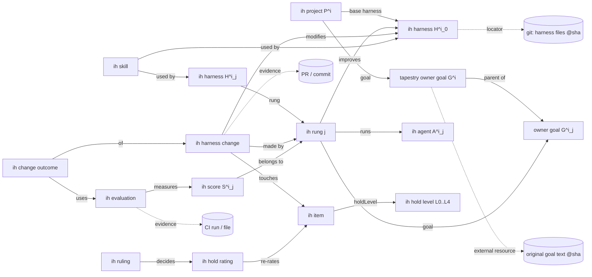

# Proposal: an IH concept model for a Tapestry instance

**Status: L3 (disclosed).** The CoS maintains this note under the scale in [`hold-axis.md`](hold-axis.md) and records each change and its reason in the changelog at the bottom. The note began as a proposal. David answered its open questions on 2026-09-27 at 6:55 PM ET, and delegated the smaller ones to the CoS. §7 records his answers and the CoS's decisions, and the rest of the note has been revised to match. With those answers, the CoS created the §4 concepts, with schemas and a small seed set of elements, on the local R&D instance (http://localhost:7778 on David's Mac, owned by Nous) on 2026-09-27 at about 7:03 PM ET. [`../graph/`](../graph/) holds the export and the script. Any write to an instance David owns (tapestry.brainstorm.world, staging.brainstorm.world) still needs his sign-off. §8 (added the same night) separates the instance's Owner from its Tapestry Assistant, and instance ownership from project authority, and says how an L0/L1 ruling is proven.

**What David asked for.** A way to represent IH data in his locally running Tapestry instance, using a feature he stressed: the concept graph's Neo4j often holds only *pointers* to data that lives elsewhere (a repo file, a local DB, a URL, a nostr event), in any format. The harness files stay in git, where diffs are auditable, and the graph holds structure plus pointers.

**Sources and honesty.** §1 comes from the Tapestry repo (`nous-clawds4/tapestry`, `main` at `1e518034`, read 2026-09-27). File citations give `path:line` against that commit. §2 comes from two read-only commands run on David's Mac at about 6:15 PM ET on 2026-09-27: GET requests only, no writes, no signing. Everything from §3 on is design. It was marked **proposal** until David's answers of 2026-09-27; the parts his answers settled are now stated as decisions, and §7 says which answer or decision each rests on. Inferences are marked **(inference)**.

## 1. How Tapestry's concept graph works

**A concept is a list header plus a fixed skeleton.** On the wire, a concept is a DList header: kind **39998** (replaceable ListHeader; kinds 9998/9999 are the legacy non-replaceable forms). Its elements are kind **39999** events whose `z` tag holds the header's address (`protocols/drafts/tapestry-concepts.md` § "Event kinds", § "Addressing"). Every node is addressed as `<kind>:<pubkey>:<d-tag>`, and that string is stored as the Neo4j `uuid` (`BIBLE.md` §5). "What makes something a concept is **not its event kind** — it's its **position in the graph**" (kind unification, same draft).

When `create-concept` runs, it mints the header plus the core nodes: a Superset, a JSON Schema, a Primary Property, a Properties set, and the property-tree, core-nodes and concept graphs (`BIBLE.md` §9, §11). It wires them with `IS_THE_CONCEPT_FOR`, `IS_THE_JSON_SCHEMA_FOR` and similar edges (§6). The **class thread** `ConceptHeader → IS_THE_CONCEPT_FOR → Superset → IS_A_SUPERSET_OF* → HAS_ELEMENT → element` is how elements are found (§6).

**Instances and properties.**

- **Each instance is a kind-39999 event.** Its data sits in a `json` tag in "word-wrapper" format (`BIBLE.md` §8). The second-brain concepts use one top-level section per concept, for example `{"externalResource": {...}}` (`src/api/normalize/index.js:2613`).
- **Properties come from the concept's JSON Schema.** `POST /api/normalize/save-schema` takes `{concept, schema}` (`src/api/normalize/index.js:1907`), and the property tree (Property nodes, `IS_A_PROPERTY_OF`) is generated from the schema (`BIBLE.md` §6).
- **Uniqueness is not enforced by the server.** "`x-tapestry.unique` is advisory only — no server code enforces it"; each write endpoint that cares must refuse duplicates itself (second-brain ADR 0004, Context).

**Relationships.**

- **Most relationships are derived** from event structure: the `z` parent pointer, and the `n`/`s` class-thread tags. "Only editorial/provenance relationships (IMPORT, SUPERCEDES, PROVIDED_THE_TEMPLATE_FOR, ENUMERATES) are explicit nostr events" (`tapestry-concepts.md`).
- **Hand-made edges are narrow.** `POST /api/normalize/add-relationship` adds a single Neo4j-only edge, but its whitelist is just `HAS_ELEMENT` and `IS_A_SUPERSET_OF` (`BIBLE.md` §11).
- **The `b` tag carries pointers between nodes.** On a 39998 or 39999 event, `["b", <address>, "pointer"]` derives `REFERENCES {source:'b-tag'}`, which is "a bookmark, not agreement". `"inherit"` derives `INHERITS_FROM` (`BIBLE.md` §22, §25).
  - On current `main` no general endpoint authors a `b` tag. `POST /api/normalize/set-b-tag` exists only in the open **PR #759** (vcavallo), which targets `main` from a feature branch and fails the repo's `main-source-guard`.
- **The second brain links by record field, never by edge.** A pointer is a field in the element's JSON (a goal slug, say) that is dereferenced at read time "by grouping — never an edge". The `HAS_RESOURCE`-edge option was rejected because it needs the whitelist extended and "would not survive export/restore" (ADR `second-brain/0004`, Decision 2 and Option B).

**How concepts are created.** There are five routes.

| Route | Mechanism | Citation |
|---|---|---|
| UI | Concepts → New Concept calls `createConcept({name, plural, description})` → `POST /api/normalize/create-concept` | `ui/src/pages/concepts/NewConcept.jsx:5,32`; `ui/src/api/normalize.js:17` |
| HTTP API | `POST /api/normalize/create-concept` with body `{name, plural?, description?, dTag? \| random? \| nonce?, conceptHeaderOverrides?}`, then `save-schema {concept, schema}`, then `create-element {concept, name, json}`. Plus `save-element-json {uuid, json}` and `set-json-tag`. | routes `src/api/normalize/index.js:5472-5474`; handlers `:1183`, `:1907`, `:1760` |
| Purpose-built brain writes | `create-child-goal`, `update-goal-intent`, `create-resource`, `verify-resource`, `create-work-record`, `note-goal-idea`, `make-proposal`, `approve-proposal`, `skip-proposal`, `record-priority-signal`. Each validates its input and refuses by name (e.g. `goal-not-found`, `resource-exists`). | `src/api/normalize/index.js:5476-5485`; handlers `:2190`, `:2523`, `:2831`, `:3158`, `:3266` |
| CLI | `tapestry concept add <name> [items...]`, `tapestry concept element <concept> <name>`, `tapestry concept schema <concept>` (tapestry-cli, a separate public repo) | `BIBLE.md` §12. The tapestry-cli repo was last pushed 2026-03-27, so it may lag the API **(inference)** |
| Nostr | Any key may publish kind 39998/39999 events. A client-signed event reaches the local relay through `POST /api/strfry/publish`, which verifies the signature and is otherwise permissionless. Firmware concepts come from `firmware/active/` via `POST /api/firmware/install`, which itself calls `create-concept`/`create-element`. | `src/api/strfry/commands/publishEvent.js:74-92`; `src/firmware/install.js:171,245`; `BIBLE.md` §7 |

**Who may write.**

- **The middleware gate.** `/api/normalize` is on the owner-only POST list (`src/middleware/auth.js:423`). A request passes if it comes from an owner session (a NIP-07 sign-in) **or** from a "genuinely-direct-local" caller: loopback peer and no proxy header (`req.localTrusted`, `auth.js:343-363`).
- **The handler gate.** The brain write handlers re-assert `isOwner(req) || req.localTrusted` (for example `:2192-2195`).
- **The gate is a tier, not an identity.** `isOwner(req)` is a backward-compatible alias for `isOwnerOrAdmin(req)` (`auth.js:276-294`): it admits a session whose pubkey is `BRAINSTORM_OWNER_PUBKEY` or an admin pubkey. Together with `req.localTrusted`, that is the single privileged write tier. Nothing in it tells the Owner apart from the Assistant or from any other local process.
- **What this means for agents.** A local agent that reaches the app over loopback (for example with `docker exec … curl`, as the IH seed script does under decision E) passes the same gate as the owner. Passing the gate does not make the agent the Owner: what it writes through `/api/normalize` is signed with the Tapestry Assistant's key, never the Owner's. From the Mac host, `localhost:7778` is not loopback inside the container: the brain read `GET /api/brain/goals` answered 403 (§2).

**Signing.**

- **Every normalize write is TA-signed.** It is signed with the instance's Tapestry Assistant (TA) key, loaded from secure storage at startup (`loadTAKey`, `src/api/normalize/index.js:90`; `signAndFinalize`, `:105`). It is then written to local strfry by `strfry import` (`publishToStrfry`, `:115`) and imported into Neo4j (`importEventDirect`).
- **These writes stay local.** The second-brain writes are "local-only, never publishEverywhere" (`:2129`).
- **What the keys mean.** `BIBLE.md` §31: the TA is "the instance's 'me'" and a hot server key. The owner's key is "cold — interactive signing (NIP-07 / external signer); never held server-side". Owner-authored letters enter the brain "only by an explicit, auditable act".
- **Unsigned state exists too.** Event-less nodes (`add-subset`) and the relationship primitives are Neo4j-only and unsigned. Under §30 such state is precious, and "only a Neo4j backup preserves" it.

**How external pointers are expressed today.**

1. **The `tapestry external resource` concept** (second-brain ADR 0004, 2026-07-23): `locatorKind` is one of `file`, `vault-note`, `nostr-event`, `repository` or `web-address` (`src/api/normalize/index.js:2409`), and `locator` is a free string. Each resource also carries a title (stored as `name`), `whyKept`, `keywords`, `notedOn`, `lastVerified` and `lastVerifyStatus`. Freshness (`current`/`stale`/`unreachable`) is derived at read time. Its identity is (goal, locator), and it must attach to exactly one existing goal (`createResource`, `:2554`). The concept's own description reads: "The brain organizes knowledge; it never contains it."
2. **Record fields** naming another element's slug (the `parent` and `goal` idiom above).
3. **Pointer-typed `b` tags** to any nostr address (§22).
4. **`lmdb:<tapestryKey>`**, which offloads a large `json` value to the local LMDB store. It is a storage detail, not a semantic pointer (§8, §29).

**Instances, Owners and Assistants** (David, 2026-09-27; Owner/Assistant distinction corrected the same night). Anyone can run a Tapestry instance, and every instance has exactly one Owner and one Tapestry Assistant. They are distinct identities with distinct keys:

- **The Owner** is the identity whose pubkey is the instance's `BRAINSTORM_OWNER_PUBKEY`. The Owner's nsec is never held by the server; the Owner signs interactively, today through a NIP-07 browser extension (`BIBLE.md` §31: "cold — interactive signing").
- **The Tapestry Assistant (TA)** has its own nsec, which is stored on the Tapestry server, as every Assistant nsec is (SecureKeyStorage key `tapestry-assistant` under `/var/lib/brainstorm/secure-keys`, `src/utils/assistantKeys.js:32-39`). It is the instance's hot key and signs every normalize write.

David (straycat) owns tapestry.brainstorm.world and staging.brainstorm.world. The local instance at http://localhost:7778 on David's Mac is owned by **Nous**, whose nsec lives in the Chrome NIP-07 extension on the Mac. **Nous' Tapestry Assistant** is a separate identity (TA pubkey `11f23fe4…`, §2) whose nsec is stored on the Tapestry server. Nous and Nous' Assistant are conceptually distinct entities: the Assistant acts for Nous but is not Nous. The whole Tapestry repo is R&D, and the local instance is one of several R&D instances; if its concepts get messed up, it is not the end of the world. So on the local instance a TA-signed record means "written by Nous' Assistant, or by something local that passed the privileged gate". It does not mean "signed by Nous", and it certainly does not mean "approved by David". Instance ownership is also separate from project authority (§8).

## 2. What the local instance showed

Two read-only commands against `http://localhost:7778` on David's Mac (`/api/status`, `/api/firmware/versions`, `/api/audit/firmware`, the two primitive probes, `/api/brain/goals`, `/api/concept-graph/summaries`, and `/neighbors` for six concepts):

- **Running and current enough.** strfry up 30 days; firmware **v1.0.0** active; the `relationship-primitives` and `node-primitives` probes present. I found no endpoint that reports the running commit, so the code version is unknown.
- **TA pubkey `11f23fe4…`.** This is the same prefix second-brain ADR 0004 cites from its "live instance" recon, so that design was probably reconnoitred on this instance **(inference)**.
- **63 concept headers**, including: `tapestry owner goal` (35 elements), `tapestry proposal` (10), `tapestry work record` (8), `tapestry external resource` (**0**), `tapestry restore drill` (1), `goal set` (2), `word` (584), `trusted dictionary snapshot` (117), `adoption disposition` (294).
- **Four concepts that appear in no repo code, docs or ADRs I searched** (my `git grep`). I guessed that David created them by hand. That guess was wrong: David says Nous' Tapestry Assistant authored them in July, probably for the dormant Goals feature. IH does not reuse them (§7, answer 4):
  - `tapestry team` (2 elements): "Something that can be handed a goal and carry it out: a team of roles, a script, or a single session given a prompt. Each entry POINTS at where it is really defined; its internals never live here."
  - `tapestry executive action` (4): "A standing instruction the Executor runs again and again — the top-level loop that tends the goal concept and mediates attention…"
  - `tapestry privacy level` (3): "levels of privacy for data stored in the second brain…"
  - `maturational state of a concept` (7).
- **`project for the engineering team`** (5 elements) is named in a second-brain story but is a different idea: "outlines of new features or bug fixes for tapestry…".
- **Owner-only reads are closed from the host.** `GET /api/brain/goals` → HTTP 403 "Owner access required", as expected from outside the container.

**The lesson from §2:** the local instance already has several parts IH needs. `tapestry owner goal` is a goal with a statement, a "done means" and a "stays inside". `tapestry external resource` is the pointer. `tapestry proposal` is an append-only sign-off loop. `tapestry work record` is an append-only log. The model below reuses them where they fit. It does not reuse `tapestry team`, even though its description reads well for agents, because David asked that the four July concepts be left alone unless they turn out surprisingly well suited, and a harness or agent needs fields that `tapestry team` does not define.

## 3. Design principles

1. **Git holds the text; the graph holds structure and pointers.** Every harness file, goal text and review stays in git. A graph element names it by a pointer pinned to a commit, with the branch recorded next to it for readability (§7, decision B). Pinning the SHA keeps the audit trail. Tracking a moving branch would not.
2. **Append-only facts for anything that changes.** Changes, predictions, outcomes, re-ratings, rulings and evaluations are new elements, never edits. This follows `tapestry proposal` and `tapestry work record` ("Never edited; corrections are new records").
3. **Link by record field holding the target's address.** A relationship is a field in the record's JSON section whose value is the target's full address (`39999:<pubkey>:<d-tag>`, or `39998:…` for a concept), dereferenced at read time. This is the second brain's idiom, with addresses in place of slugs (§7, decision A). It does not depend on `set-b-tag` or PR #759.
4. **Reuse by default.** An existing concept is reused wherever its meaning fits, and David encourages this. When two use cases turn out not to be well aligned, the concept graph will support forking the concept into two or more distinct concepts, so reuse now does not lock anything in. Only the IH-specific concepts are new, and they get an `ih ` name prefix so they cannot collide with second-brain data.
5. **The graph records the hold axis; git holds the L0 text; an authority signature proves an L0/L1 ruling** (§6, §8). On the local R&D instance, ordinary records are signed with the Tapestry Assistant's key, and David's personal key is not required. The exception is a ruling on an L0 or L1 item: it counts only if it is a nostr event signed by the project's authority key (§8).

## 4. Proposed concepts

Here "fields" means the concept's JSON section. `→` marks a record-field link: a field holding the target's address. Every record also carries `name`, `slug` and `description`, as the second-brain records do. A **pointer** is an object with the external-resource vocabulary plus the pin (§7, decision B).

| Concept | Reuse or new | Fields | Links | External pointers |
|---|---|---|---|---|
| **Project** $P^i$ | new `ih project` | `index` (0, 1, 2 …), `name`, `status`, `openedOn`, **`authority`** (the project authority's hex pubkey; an L0 item, §8; not yet in the instance schema) | → `goal` ($G^i$), → `baseHarness` ($H^i_0$), → `agent` ($A^i$) | `repository` (the project repo) |
| **Goal** $G^i_j$ | **reuse `tapestry owner goal`** | `statement`, `deliverable` (done means), `boundary` (stays inside), `origin`, `capturedOn` | → `parent`. A rung goal $G^i_j$ ("improve $H^i_{j-1}$") is a child of $G^i$ | a `tapestry external resource` on the goal, pointing at the **original** goal text at a pinned SHA, for the drift check (d) |
| **Harness** $H^i_j$ | new `ih harness` | `j` (the rung index), `version` (commit SHA), `branch`, `status` | → `project`, → `rung` (the rung that produced it; none for $H^i_0$), → `supersedes` (previous version) | `locators`: one pointer per harness-definition path |
| **Rung** $j$ | new `ih rung` | `project`, `j`, `scoreDefinitions`, `minHistory` (the §1 measurement gate), `mode` (`separate` or `merged-into-lower`) | → Goal ($G^i_j$), → `improves` Harness ($H^i_{j-1}$), → Agent ($A^i_j$) | none |
| **Agent** $A^i_j$ | new `ih agent` (not `tapestry team`; see §2 and §7) | `role` (PM, Rung Manager, reviewer…), `model`, `account` | → `runs` (Harness), → `rung` | `definition` (agent definition file); `web-address` for an external model |
| **Skill** | new `ih skill` | `name`, `holdLevel` (the strictest consumer's, per lit. review §7), `provenIn` | → `usedBy` [Harness …] | `repository` (`SKILL.md` at a SHA) |
| **HarnessChange** | new `ih harness change` (append-only) | `summary`, `why`, `origin`, **`prediction`** `{expect, atRisk, metric, horizon}`, `diffAudit` `{weakenedDefinitions, removedChecks, demotions}` | → `modifies` Harness, → `madeBy` Rung, → `touches` [Item …] | **evidence**: PR / commit `web-address` or `repository` locators |
| **ChangeOutcome** | new `ih change outcome` (append-only) | `verdict` (`confirmed`, `refuted`, `reverted`, `inconclusive`), `before`, `after`, `observedOn` | → HarnessChange, → [Evaluation …] | evidence locators |
| **HoldLevel** | new `ih hold level`, five fixed elements L0–L4 | `rank` (0–4), `label` (Locked, Sign-off, Reviewed, Disclosed, Free), `whoMayChange`, `requires` (the table in `hold-axis.md` §3) | none | `repository` (`hold-axis.md` at a SHA) |
| **Item** | new `ih item` (a rule, check, definition or file placed on the axis) | `itemType`, `summary` (short; the text stays in git), `holdLevel` (**derived** from the latest valid Rating) | → Harness, → HoldLevel | `repository` locator with an anchor |
| **Rating** | new `ih hold rating` (append-only) | `from`, `to`, `direction` (promote or demote), `reason`, `proposedBy` | → Item, → Ruling (required for a demotion) | none |
| **Ruling** | new `ih ruling` (§6, §8) | `decision` (approve or refuse), `reason`, `ruledBy`, `ruledOn`, **`project`** and **`level`** (§8). **Required signer:** a ruling on an L0 or L1 item is valid only if the event's author pubkey is the project's `authority` and its signature verifies; below L1 the TA may record rulings | → `decides`: the Rating or HarnessChange it decides; → `project` | `evidence`: the git commit or PR where the decision is carried out |
| **Score** $S^i_j$ | new `ih score` | `name`, `method`, `heldOut` (bool), `direction` (higher or lower is better) | → Rung | `repository` (the script that computes it) |
| **Evaluation** | new `ih evaluation` (append-only) | `value`, `n`, `measuredOn`, `window` | → Score, → Harness version or → HarnessChange | `web-address` (a `gh` run, a PR), `repository` (an output file) |

The prediction and outcome pair is the literature review's second recommendation (AHE-style, §4 and §8.2). A HarnessChange with a ChangeOutcome is exactly one rung-2 data point.



Solid arrows are record-field links. Dotted arrows are pointers out of the graph.

**Why a goal reuses `tapestry owner goal`.** On the local instance, an owner goal is the instance owner's goal, and the owner is Nous, while $G^i$ is David's. The concept's fields (statement, done means, stays inside, parent) fit $G^i$ exactly, so under principle 4 it is reused. If "a goal the owner holds" and "a goal a project serves" pull apart, it is the first candidate for a fork. The same goes for `tapestry external resource`: its identity rule ties each resource to exactly one goal, so IH records that are not goals carry their pointers as fields with the same vocabulary (`locatorKind`, `locator`) instead of as resource elements.

## 5. Instantiation examples

These illustrate the shape. They were written before David's answers and nothing in this section was sent. Placeholders in angle brackets are values that are not known.

**Physics, $P^1$** (facts from [`examples/physics.md`](examples/physics.md)):

- `ih project` "physics": `index: 1`, repository `github.com/nous-clawds4/physics`, `authority`: David as straycat (§8). Nous owns the instance these records sit on, but Nous is not P1's authority.
- Goal: a `tapestry owner goal` whose `statement` quotes the *Statement of the Problem* essay's opening. Its external resource points at that essay at `<sha>:<path>` (the path is not recorded in physics.md).
- `ih harness` $H^1_0$ at `<sha>`, with locators for `papers/`, `public-papers/observer-space-framework/`, `versions/` and `reviews/`.
- `ih item` "No $\lvert a\rvert^2$ in by hand": `holdLevel` L0. Its Rating has direction promote, from none to L0, and needs no Ruling.
- `ih item` "cover notes for the external referee": proposed at L2. Currently cover notes are merged without review, so this Rating is a promotion.
- `ih harness change` "panel rules (a) and (b)" (2026-09-27): `why` "external review #128 found at least eight outline bullets dropped or weakened after three panel PASSes". Evidence #128, #130, #131, #132. `prediction` (a **proposal**, since no prediction is recorded in the repo): "the next external review finds no dropped or weakened outline bullets". Its ChangeOutcome stays open until the v0.6 external review (cover #145) returns.
- `ih evaluation` for the score "panel catch rate", v0.5: 3 panel PASSes (#124–#126), then 6 must-fix items from #128.

**Tapestry, $P^2$** (facts from [`examples/tapestry.md`](examples/tapestry.md)):

- `ih project` "tapestry": `index: 2`, repository `github.com/nous-clawds4/tapestry`.
- Goal: a `tapestry owner goal` whose statement quotes the README's first sentence. External resources point at `README.md` and `ROADMAP.md` at `1e518034`.
- `ih harness` $H^2_0$ at `1e518034`, with one locator per line of `scripts/harness-def-paths.txt`.
- `ih item` "PRs into `main` only from `staging`, `promote/*` or `hotfix/*`": proposed L0. Its locator is `.github/workflows/guard-main-source.yml@1e518034`, plus a `web-address` for ruleset 15863292.
- `ih harness change` "main-source-guard" (2026-08-07, PR #517): `why` quotes the workflow comment about PR #446. `prediction` is retrofitted and marked as such: "no feature-branch PR merges into `main`". ChangeOutcome `confirmed`: since 2026-08-28 every PR merged into `main` came from `staging` or `promote/*`, and the guard failed 3 runs (PRs #583 and #759) (my count).
- `ih harness change` (proposed): "count every CHANGES_REQUESTED round in `harness-stats.sh`". `prediction`: "the reported kick-back rate rises from 0%".
- `ih skill` `cycle-staging` (`.claude/skills/cycle-staging/SKILL.md@1e518034`), `usedBy` $H^2_0$.
- For cross-fertilization, a future `ih skill` "literature review" (IH's own `docs/literature-review.md` method) would be `usedBy` the rung-1 harnesses of both $P^1$ and $P^2$. The query "skills used by more than one harness" is then a grouping over `usedBy`.
- `ih evaluation` for "CI red rate" (`stack-free`), 2026-08-28 to 2026-09-27: 8 of 209 decided runs; evidence `gh run list --workflow test.yml`.

What one element looks like when created through the generic API. It follows the decisions in §7: links are addresses, and pointers pin a commit. The JSON section's key is the concept's primary-property key (`ihHarnessChange` for `ih harness change`), which is how `create-concept` names it. The d-tag is passed explicitly and equals what `create-element` would derive by default (`slug(name)-hash8(conceptAddress)`, `src/lib/dtag.js:51`), so a record's address is known before it is written. This example was not sent.

```json
POST /api/normalize/create-element   (example; not sent)
{ "concept": "ih harness change",
  "name": "tapestry main-source-guard 2026-08-07",
  "dTag": "tapestry-main-source-guard-2026-08-07-<hash8>",
  "json": { "ihHarnessChange": {
      "name": "tapestry main-source-guard 2026-08-07",
      "slug": "tapestry-main-source-guard-2026-08-07",
      "description": "PRs into main only from staging, promote/*, hotfix/*",
      "modifies": "39999:<TA pubkey>:<d-tag of the H^2_0 record>",
      "madeBy": "39999:<TA pubkey>:<d-tag of the tapestry rung-1 record>",
      "summary": "PRs into main only from staging, promote/*, hotfix/*",
      "why": "PR #446 bypassed staging (workflow comment)",
      "prediction": { "expect": "no feature-branch PR merges into main",
                      "metric": "main-source-guard failures; non-allowed heads merged",
                      "horizon": "rolling", "retrofitted": true },
      "evidence": [ { "locatorKind": "web-address",
                      "locator": "https://github.com/nous-clawds4/tapestry/pull/517" },
                    { "locatorKind": "repository",
                      "locator": "github.com/nous-clawds4/tapestry@1e518034a9e0277a79d27747bb26ece59c55023d:.github/workflows/guard-main-source.yml",
                      "repo": "nous-clawds4/tapestry", "branch": "main",
                      "commit": "1e518034a9e0277a79d27747bb26ece59c55023d",
                      "path": ".github/workflows/guard-main-source.yml" } ] } } }
```

A purpose-built `ih` write endpoint, like the second brain's, would be better than `create-element`. It could refuse a HarnessChange with no prediction, a demotion with no Ruling, or a duplicate locator, as `create-resource` refuses today.

## 6. Recording and enforcing the hold axis in the graph

**Recording is easy.** An Item's current level is derived at read time from its append-only Ratings, much as the second brain derives a goal's standing and a resource's freshness. A rung-2 audit becomes a query: every Rating with `direction: demote` and no valid Ruling, and every HarnessChange whose `diffAudit.demotions` is non-empty. Those are flagged, not scored (lit. review §5, idea 3). Because the text stays in git, a level change shows up in the git diff as well (`hold-axis.md` §6). The graph adds the cross-project view that git lacks.

**Enforcing is harder, because every write looks the same.**

- Every `/api/normalize` write is signed by the same TA key.
- The gate is `isOwner(req) || req.localTrusted` (`auth.js:343-363`), so an agent reaching the app over loopback passes it exactly as the owner does.
- `approve-proposal` has the same gate (`src/api/normalize/index.js:3266-3270`).
- So a TA-signed "approval" proves only that *something local* wrote it. This is the weakness of any approval gate that rests on a local check, such as an interactive prompt or a local file, rather than a signature: it is not cryptographic (`assessments/brainstorm-harness.md`, idea 3).

**Decision: L0 text stays in git; an L0/L1 ruling is proven by the project authority's signature** (David, 2026-09-27, answer 3, refined the same night; details in §8). The local instance is an R&D instance owned by Nous, so ordinary IH records there are signed with the Assistant's key, and David's personal key is not required for them. A TA signature cannot prove who approved a demotion, so it is not accepted as a ruling on an L0 or L1 item. The L0 and L1 items stay files in the IH repo, and a change to them is still a git commit. What authorises that change is a ruling event signed by the project's authority key and published to the instance relay. The harness verifies the ruling's author and signature itself, because Tapestry's single write tier cannot tell the Owner, the Assistant and a loopback caller apart (§1). An `ih ruling` still points at the commit or PR that carries the change out (its `evidence` pointer), so a reader can check both halves: the signature says who decided, and git shows what changed.

This replaces the earlier "kept for later: owner-signed rulings" paragraph. That paragraph tied the signing key to the instance Owner and deferred it to an instance David owns. The signing key is now the *project's* authority, whoever owns the instance, and it applies on the local instance today. The two costs it named are still real and are handled in §8: client-signed events land in strfry but are not imported into Neo4j (`src/api/strfry/tapestryBrainWrite.js`, header: third-party letters "are NOT imported here"), so the harness reads rulings from the relay; and the relay-privacy rule (decision C) applies to them.

**Relay privacy.** Normalize writes are local: `publishToStrfry` pipes the event to `strfry import` (`src/api/normalize/index.js:115`), and nothing in the handler publishes outward. The one server-side path to public relays is the strfry router, whose streams are listed by `GET /api/strfry/router-status` and written to `/etc/strfry-router-tapestry.config` (`src/api/strfry/routerStatus.js`, `routerConfig.js`). If the `dcosl` preset (both directions, kinds 9998/9999/39998/39999) were enabled, IH events would be mirrored to public relays (`BIBLE.md` §14 "Router Presets"). §7, decision C sets the rule every IH writer follows.

## 7. David's answers and the CoS's decisions (2026-09-27)

David answered at 6:55 PM ET on 2026-09-27. His four answers are summarised first, then the decisions he delegated to the CoS. The eight open questions this section used to hold are all resolved here; the last list says where each one went.

**David's answers.**

1. **$G^2$ covers every kind of instance.** Anyone can run a Tapestry instance: an individual for personal use, a community leader whose "customers" are the members of the community, or an enterprise such as NosFabrica running it as a service that will be an alternative to Google search in at least some contexts. The ladder must understand and protect all of these use cases. [`examples/tapestry.md`](examples/tapestry.md) now states $G^2$ that way.
2. **Reuse concepts wherever it makes sense.** Reuse is encouraged. The concept graph will ultimately support forking a concept into two or more distinct concepts when use cases are not well aligned (principle 4).
3. **Each instance has an Owner, and the local instance is R&D.** David owns tapestry.brainstorm.world and staging.brainstorm.world; Nous owns the local instance. Signing IH records with the instance key is acceptable there, and David's personal key is not required. "The instance key" here is Nous' Tapestry Assistant's key, not Nous' own key (§1). L0 text stays in git (§6); rulings on L0/L1 items were later made to require the project authority's signature (§8).
4. **Leave the four July concepts alone.** `tapestry team`, `tapestry executive action`, `tapestry privacy level` and `maturational state of a concept` were authored by Nous' Tapestry Assistant in July, probably for the dormant Goals feature. IH does not reuse them. Agents get their own concept, `ih agent`.

**Decisions delegated to the CoS.**

- **A. Links are fields holding addresses.** A link is a field in the record's JSON section whose value is the target's full address (`39999:<pubkey>:<d-tag>`, or `39998:<pubkey>:<d-tag>` for a concept). A field that can name several targets holds an array of addresses. An address is what Neo4j stores as `uuid`, so a reader can join on it directly, and unlike a slug it is unique across concepts and authors. IH writes pass an explicit d-tag equal to `create-element`'s default derivation, so an address is known before the record is written and two records can point at each other. The model does not depend on PR #759 or on `set-b-tag`. If pointer-typed `b` tags land later, they may be added alongside the fields, and the fields stay authoritative.
- **B. Pointers pin a commit and record the branch.** A pointer into git is an object: `{ "locatorKind": "repository", "locator": "github.com/<owner>/<repo>@<full sha>:<path>[#anchor]", "repo": "<owner>/<repo>", "branch": "<branch>", "commit": "<full sha>", "path": "<path>" }`. The `locator` string alone is enough to resolve it; the other fields make it readable and queryable. `branch` records which line of history the commit was read from and is never used to resolve the pointer. Pointers of other kinds (`web-address`, `nostr-event`) use the same object with only `locatorKind` and `locator`.
- **C. Relay privacy is confirmed before every write.** An IH writer refuses to write unless it confirms, in the same run and immediately before writing, that: the `dcosl` preset is present and disabled; no enabled stream with direction `up` or `both`, in either the router state or the router config file, has a filter that could match an IH event (by kind, author or tag); and no `strfry sync` with direction `up` or `both` is running or scheduled. If any of this cannot be read, the writer treats it as a failure and writes nothing. IH data stays on the machine. On 2026-09-27 the local instance passed this check. The `dcosl` preset was disabled. Seven outbound streams were enabled, and none could carry an IH event: five `both` streams to dcosl.brainstorm.world are limited by `#z` to firmware tag concepts, and two are limited by kind ([`../graph/README.md`](../graph/README.md)).
- **D. The IH repo keeps a JSON export of the graph.** A `graph/` folder in this repo holds a JSON export of every IH concept and element on the instance, regenerated after each batch of writes, with the instance, the TA pubkey, the date and the commits the pointers were pinned to. Git then remains the audit trail for the graph's structure as well as its text, and another instance can recreate the IH graph from the export.
- **E. Who writes, for now.** A CoS script run on David's Mac calls the normalize API over the container's loopback (`docker exec tapestry …`), which `auth.js` lets through the same privileged gate as an Owner session (`src/middleware/auth.js:354-362`, the `isDirectLocal` branch). The records it creates are signed with Nous' Tapestry Assistant's key; the script never holds or uses Nous' key or David's. `create-concept`'s own duplicate check compares against a double-encoded pubkey (the comment at `src/api/normalize/index.js:1255-1259` names the double encoding), so by my reading of the code it cannot match an existing header, so the script checks for existing concepts itself and skips them. A purpose-built `ih` endpoint that refuses a HarnessChange without a prediction, or a demotion without a Ruling, is still the better long-term shape; it would be a Tapestry change and go through Tapestry's own harness.

**Where the old open questions went.** Namespace (old 1): answer 2 and principle 4. The July concepts (old 2): answer 4. Who writes (old 3): decision E. Owner-signed rulings (old 4): answer 3 and §6, then §8 (rulings are signed by the project authority, not the instance Owner). Edges (old 5): decision A. Locators (old 6): decision B. Privacy (old 7): decision C; `tapestry privacy level` is not used (answer 4). Reproducibility (old 8): decision D.

## 8. Owners, Assistants and project authority (2026-09-27, night)

David and the CoS agreed this design in conversation on the night of 2026-09-27. It corrects §1 (the Owner and the Assistant are distinct), and it adds project authority, which §1–§7 did not have. Tapestry facts below were checked against the Tapestry repo at `1e518034`, the same commit as §1. Nothing in this section has been written to any Tapestry instance.

### 8.1 Owner and Assistant in the Tapestry+IH paradigm

- **Every instance has an Owner and a Tapestry Assistant.** The Owner is usually a human. The Assistant is aligned with the Owner's values, goals and beliefs and acts for the Owner, under its own key (§1).
- **The Chief of Staff plays the Tapestry Assistant role.** The CoS that runs the ladder is the Owner's Assistant.
- **An off-the-shelf IH is personalized per Owner.** The README's footnote [3] says the Infinite Harness is to be personalized to the human who controls the CoS. In Tapestry terms, a stock IH installed on an instance becomes that Owner's IH. The Owner has the final say, but delegates as much as is feasible to the Assistant.
- **On the local instance** (http://localhost:7778 on David's Mac), the Owner is Nous and the Assistant is Nous' Tapestry Assistant (§1). The Owner here happens not to be a human, which is fine for an R&D instance.

### 8.2 Instance ownership is separate from project authority

Owning the instance where a project's records live does not make you that project's authority.

- **Each IH project records its authority** as an L0 item: the hex pubkey of the project owner, whose signature is required on the project's L0 and L1 rulings. It is L0 because whoever can change it can forge every ruling (§8.3).
- **The authority anchor lives in git.** The value the harness trusts is read from the IH repo at a pinned commit. The `authority` field on the `ih project` record (§4) mirrors it, and any mismatch between the two is treated as a failure. The graph copy cannot be the anchor, because the graph record is written with the Assistant's key.
- **Changing the authority is itself an L0 change.** It needs a ruling signed by the *current* authority key. The harness checks the anchor's history as well as its value: every change after the first must be covered by such a ruling. The public IH repository now has mechanical goal protection: ruleset `24088273` (`main-goal-protection`) requires a pull request for `main`, requires code-owner review for covered paths, blocks force-pushes and branch deletion, and has no bypass actors. `.github/CODEOWNERS` assigns `@wds4` to `/README.md`, `/docs/hold-axis.md`, and `/.github/CODEOWNERS`. `nous-clawds4` remains a repository administrator and could edit or delete the ruleset, but that would be a visible, audited settings change; the history check also makes any unauthorized authority-anchor edit visible and ineffective.
- **Physics, $P^1$.** The authority is David as straycat, even though Nous owns the local instance. The public npub listed for David in Tapestry's `BIBLE.md` §20 is `npub1u5njm6g5h5cpw4wy8xugu62e5s7f6fnysv0sj0z3a8rengt2zqhsxrldq3` (hex `e5272de914bd301755c439b88e6959a43c9d2664831f093c51e9c799a16a102f`). It is the **proposed** value. Because the item is L0, it is recorded only when David records it or confirms it himself. The authorities of $P^0$ (the ladder) and $P^2$ (Tapestry) are not recorded yet.
- **David's personal nsec is deliberately not on the Mac.** Nothing on the local instance, and no agent running there, can sign as straycat.

### 8.3 How an L0/L1 ruling is proven

**The rule.** A ruling on an L0 or L1 item of project $P^i$ counts only if it is a nostr event signed by $P^i$'s authority key. A TA-signed record, a git commit by an agent account, or a chat message can report a ruling, but none of them is one.

**How David makes one.** He signs the ruling on any client or device where his key already lives. The event is then published to the instance relay. Tapestry accepts externally signed events: `POST /api/strfry/publish` with `signAs: "client"` (or no `signAs`) takes an already-signed event, checks that `id`, `sig` and `pubkey` are present, verifies the signature against the claimed pubkey, and imports the event into the local strfry (`src/api/strfry/commands/publishEvent.js:74-92`, `:97-112`). Client-signed publishing needs no session: the path is on the exact-match `PUBLIC_MUTATIONS` list (`src/middleware/auth.js:485`), and only `signAs: "assistant"` is gated to the Owner tier (`publishEvent.js:48-55`). The event is a kind-39999 element whose `z` tag is the `ih ruling` concept (`39998:11f23fe4…:ih-ruling` on the local instance), authored by David's pubkey. Tapestry allows this, since any key may publish 39998/39999 events (§1, the Nostr route).

**Two things to know about that path.**

- **Rulings stay in strfry.** The brain-write hook imports only the instance's own tapestry letters (kind 39999, `z` = the instance's `tapestry` concept, authored by the TA or the Owner). Third-party letters "are NOT imported here" (`src/api/strfry/tapestryBrainWrite.js`, header and `isOwnedTapestryEvent`). A ruling signed by David therefore lives in strfry, not in Neo4j, and the harness reads it from the relay with a filter such as `{"kinds":[39999], "authors":[<authority hex>], "#z":["39998:<TA pubkey>:ih-ruling"]}`.
- **Privacy.** Decision C still governs outbound streams from the instance. On 2026-09-27 no enabled stream could carry a kind-39999 IH event (§7, C). Separately, the client David signs with may broadcast the event to its own default relays. Whether a given ruling may be public is David's call when he signs it.

**What the harness checks.** Tapestry cannot enforce the rule by itself. Its auth has a single privileged write tier: an Owner-or-admin session, or a genuinely-direct loopback caller (§1). So Nous, Nous' Assistant and any local script look the same to it. The harness therefore verifies every ruling itself, before acting on it:

1. The event's `id` is the hash of its serialized content, and `sig` is a valid signature by `pubkey` (for example nostr-tools `verifyEvent`, on a JSON round-trip of the event, as `publishEvent.js` does).
2. `pubkey` equals the project's authority, read from the git anchor (§8.2), not from the graph.
3. The ruling names this project and the exact target it decides (the Rating's or HarnessChange's address, or the commit SHA of the change), and its `level` matches the item's current level. A ruling for one target does not authorise another.
4. For a demotion (hold-axis §4), `decision` is `approve`.

A ruling that fails any check is ignored and flagged. It is not repaired, and the TA does not record a substitute.

**What Nous and the Assistant can and cannot do.** Both can read rulings: they are ordinary events in the instance relay. Neither can forge one. Nous' key is not the P1 authority, the Assistant's key is not either, and David's key is not on the machine. Either of them could still publish a ruling-shaped event under its own key, or write a TA-signed `ih ruling` record that claims one. Check 2 rejects both.

### 8.4 New concepts and fields this implies

These are design changes to §4. They are **not yet on the local instance**. Adding them there is a write, and it waits for a later, separate run under decision C.

- **`ih project.authority`**: the project authority's hex pubkey, mirroring the L0 anchor in git (§8.2).
- **`ih ruling.project`** (the project record's address) and **`ih ruling.level`** (the level of the item decided, L0–L4).
- **A ruling's required signer**: for `level` L0 or L1, the event author must be the project's `authority`. For an item at L2–L4 the approver is the level above the proposer (hold-axis §4), and a TA-signed record is acceptable.
- `ih ruling.ruledBy` stays a human-readable label. It is never used for verification; the event's `pubkey` is.

### 8.5 Tapestry feature requests

Two requests for Tapestry follow from this design. Both are proposals and have not been filed in the Tapestry repo.

1. **NIP-46 remote signing for sign-in.** Tapestry sign-in is NIP-07 only today (the auth book's PRD seed, §5: "NIP-07 is the sign-in mechanism"). Broadening it to remote signers is listed as an open product question: "Is broadening sign-in beyond NIP-07 (remote signers / NIP-46) a wanted direction, or is NIP-07-only the intended product stance?" (`engineering-team/audits/auth-signature-verification/prd-seed.md`, §1 and §7). With NIP-46, an Owner could sign in to an instance while their key stays on another device. That is exactly David's situation: his key is deliberately not on the Mac.
2. **An Assistant write tier distinct from the Owner.** Today `isOwner(req) || req.localTrusted` is the one privileged tier (§1). A separate tier for the Assistant, and for agents acting through it, would let Tapestry itself refuse Owner-only acts, such as recording a ruling, when they come from the Assistant. The harness would still verify signatures (§8.3), but the server would no longer treat every local caller as the Owner.

## Changelog

- 2026-09-27: created by the CoS (L3, proposal).
- 2026-09-27 (evening): revised by the CoS (L3) after David's answers of 6:55 PM ET. Added the instance-and-owner model to §1. Corrected §2: the four July concepts were authored by Nous' Tapestry Assistant, not by David, and are no longer reused. Rewrote §3 around reuse by default (with forking), address-valued links and commit-pinned pointers. In §4, replaced `tapestry team` with a new `ih agent` concept, dropped the owner-signed requirement from `ih ruling`, and explained why `tapestry owner goal` is still reused. Updated the §5 example to the new link and pointer shapes. Rewrote §6: L0 stays in git, TA signing is acceptable on the local R&D instance, owner-signed rulings are kept for later, and relay privacy is spelled out. Replaced the §7 open questions with David's answers and the CoS's decisions A–E.
- 2026-09-27 (night): the CoS (L3) noted in the status line that the §4 concepts now exist on the local instance, and added the result of the first relay-privacy check to decision C. Both link to the new `graph/` export.
- 2026-09-27 (night, later): revised by the CoS (L3) after a design David and the CoS agreed in conversation. Corrected §1: on the local instance the Owner is Nous (nsec in the Chrome NIP-07 extension) and Nous' Tapestry Assistant is a distinct identity whose nsec is stored on the Tapestry server; added that `isOwner` is an owner-or-admin alias and that passing the gate is not being the Owner. Reworded §3 principle 5, §7 answer 3 and decision E so that "the instance key" is clearly the Assistant's key. Replaced §6's "kept for later: owner-signed rulings" with the rule that an L0/L1 ruling counts only if it is signed by the project's authority key. Added `authority` to `ih project` and a required signer, `project` and `level` to `ih ruling` in §4, and the P1 authority to the §5 example. Added §8: the Owner/Assistant paradigm (the CoS plays the Assistant role; an off-the-shelf IH is personalized per Owner), instance ownership versus project authority (P1's authority is David as straycat; the value is proposed, pending David), how a ruling is signed, published and verified, the new fields, and two Tapestry feature requests (NIP-46 sign-in; an Assistant write tier). Nothing was written to any Tapestry instance.
- 2026-09-27 (public release): the CoS (L3) reworded two passages in §1 and §6 that cited internals of a colleague's private harness experiment, because that project is private and `assessments/brainstorm-harness.md` was rewritten for the public release. The points they make (a loopback caller passes the Owner-tier gate; a local, non-cryptographic approval gate proves nothing about who approved) are unchanged. See [`HISTORY.md`](HISTORY.md).
- On 2026-09-27 (night), this L3 note was revised in §8.2 to replace the convention-only description of goal protection with the public repository's ruleset and CODEOWNERS enforcement, while retaining the administrator-editability and authority-history caveats.
